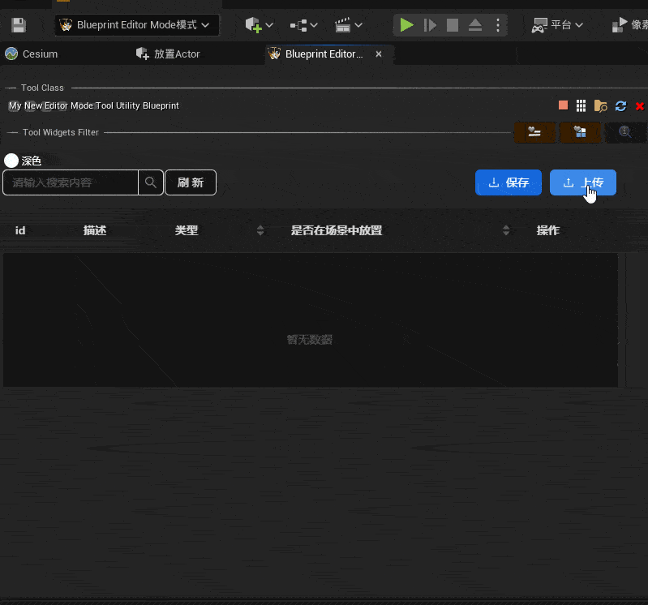
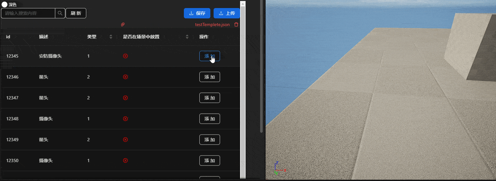
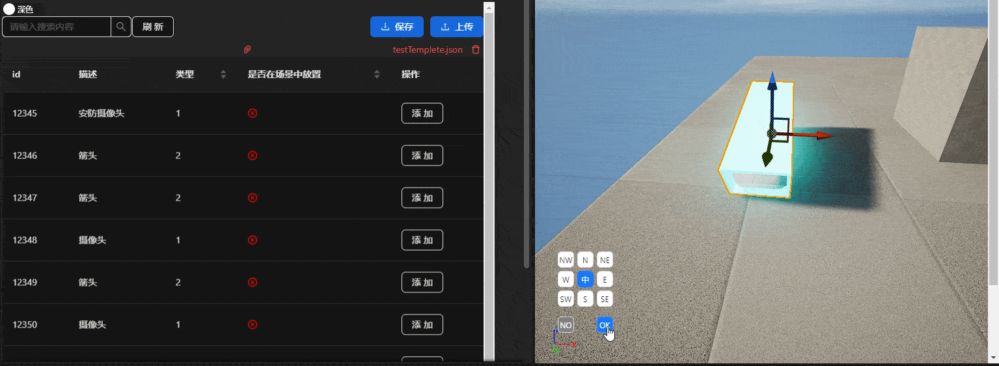
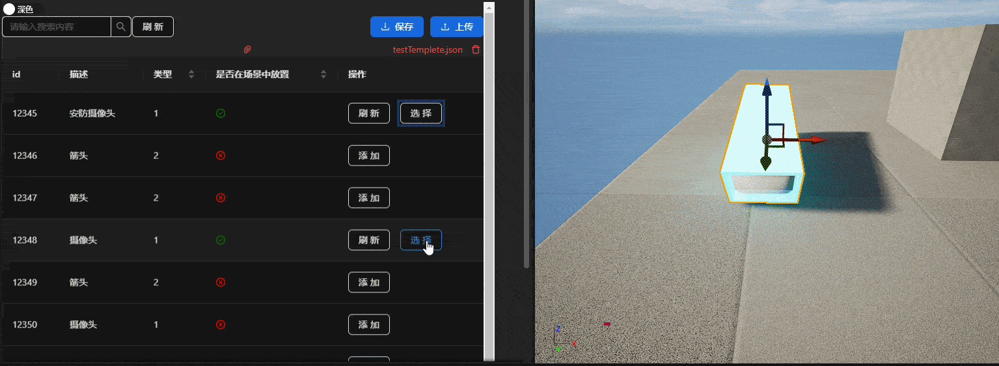
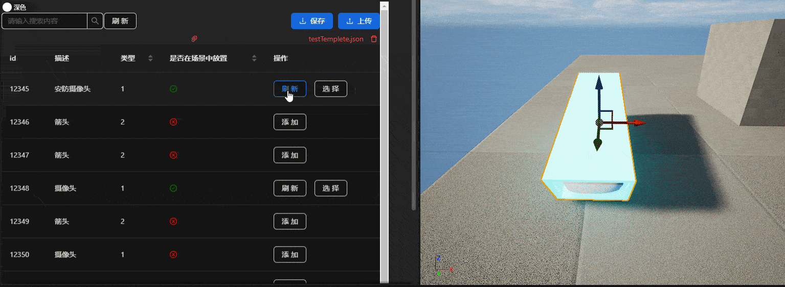
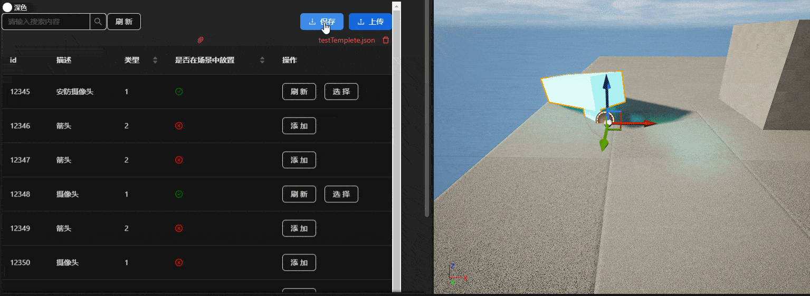

[TOC]

# unreal-editor-tool

---

### 该插件的作用

使在场景中放置大量带有独特的数据的`mesh`更加轻松，添加`mesh`的位置、旋转和缩放信息，并保存为`json`

### 功能

* 导入`json`文件



* 根据`json`信息在场景中生成mesh



* 将新的`actor`的位置、旋转和缩放信息，保存到`json`中



* 视角跳转



* 重置`Actor`信息



* 导出\保存`json`信息



  

 * 排序、搜索和切换主题

  

### 使用方法

* 下载[release](https://github.com/wild-deer/unreal-editor-tool/releases)


* 将插件解压缩，放在`unreal`项目的目录下


* 启动工程，在插件中启用`editor tool`


* 选择模式


启动插件


* 导入`json`

新建文件`test.json`格式如下

```json
{
    "body": [
        {
            "id": 12345,
            "location": null,
            "rotation": null,
            "scale": null,
            "placedinUE": "FALSE",
            "describe": "安防摄像头",
            "type": "1"
        },
        {
            "id": 12346,
            "location": null,
            "rotation": null,
            "scale": null,
            "placedinUE": "FALSE",
            "describe": "箭头",
            "type": "2"
        },
        {
            "id": 12347,
            "location": null,
            "rotation": null,
            "scale": null,
            "placedinUE": "FALSE",
            "describe": "箭头",
            "type": "2"
        },
        {
            "id": 12348,
            "location": null,
            "rotation": null,
            "scale": null,
            "placedinUE": "FALSE",
            "describe": "摄像头",
            "type": "1"
        },
        {
            "id": 12349,
            "location": null,
            "rotation": null,
            "scale": null,
            "placedinUE": "FALSE",
            "describe": "箭头",
            "type": "2"
        },
        {
            "id": 12350,
            "location": null,
            "rotation": null,
            "scale": null,
            "placedinUE": "FALSE",
            "describe": "摄像头",
            "type": "1"
        },
        {
            "id": 12351,
            "location": null,
            "rotation": null,
            "scale": null,
            "placedinUE": "FALSE",
            "describe": "箭头",
            "type": "2"
        },
        {
            "id": 12352,
            "location": null,
            "rotation": null,
            "scale": null,
            "placedinUE": "FALSE",
            "describe": "摄像头",
            "type": "1"
        },
        {
            "id": 12353,
            "location": null,
            "rotation": null,
            "scale": null,
            "placedinUE": "FALSE",
            "describe": "箭头",
            "type": "1"
        },
        {
            "id": 12354,
            "location": null,
            "rotation": null,
            "scale": null,
            "placedinUE": "FALSE",
            "describe": "摄像头",
            "type": "1"
        },
        {
            "id": 12355,
            "location": null,
            "rotation": null,
            "scale": null,
            "placedinUE": "FALSE",
            "describe": "摄像头",
            "type": "1"
        },
        {
            "id": 12356,
            "location": null,
            "rotation": null,
            "scale": null,
            "placedinUE": "FALSE",
            "describe": "摄像头",
            "type": "1"
        }
    ]
}
```

初始时`location`,`rotation`,`scale`为`null`，`placedinUE`为`FALSE`，`type`的值决定了在场景中生成的`actor`的类型

点击上传

* 添加`actor`位置信息

鼠标左键点击添

点击过后在场景中目标位置点击鼠标左键可生成临时actor


点击保存后会这个临时的`actor`会被删掉

点击选择后会选中该`actor`，按`F`可以跳转视角
点击刷新可以重新添加该物体的位置信息

* 改变按钮的颜色

* 保存\导出`json`

将表格中所有缺失位置信息的物体的信息添加补全，可以导出保存这个表格，导出的路径默认为项目路径

### 修改页面样式

如果需要改变表格或按钮的样式和布局等，可以按照下述步骤进行操作

* 克隆仓库

```bash
git clone https://github.com/wild-deer/unreal-editor-tool.git
```

* 用`WebStorm`打开

界面的入口为`index.js`

```js
//index.js
import React from 'react';
import ReactDOM from 'react-dom/client';
import './index.css';
import App from './App';
import reportWebVitals from './reportWebVitals';
import { ConfigProvider} from 'antd'
import zhCN from "antd/lib/locale/zh_CN";
import mytheme from "./theme"
import { CheckOutlined } from '@ant-design/icons';
import { Space, Switch } from 'antd';
const root = ReactDOM.createRoot(document.getElementById('root'));

root.render(
        <App/>
);

reportWebVitals();

```

`index`挂载了一个组件`App.js`

```js
// App.js
import {React, useState} from "react";
import { HashRouter,Route,Routes} from "react-router-dom";
import MyMenu from "./menu";
import MySubMenu from "./submenu";
import Test from "./test";
import './App.css';


// 定义根组件
function App() {
    return (
        <HashRouter>
            {/* 定义路由 */}
            <Routes>
                <Route path="/editor" element={<MyMenu />}/>
                <Route path="/rotate" element={<MySubMenu />} />
                <Route path="/test" element={<Test />}/>
            </Routes>

        </HashRouter>

    );
}
export default App;
```

`App`加载了两个子组件`menu.js`,`submenu.js`，还有一个测试页面

在启动`npm`之后的路由链接分别是

`http://localhost:3000/#/editor`

`http://localhost:3000/#/rotate`

`http://localhost:3000/#/test`


`menu.js`

```js
import React, { useState, useEffect } from 'react';
import { UploadOutlined,DownloadOutlined,CheckCircleOutlined,CloseCircleOutlined} from '@ant-design/icons';
import {Table, Button, message, Upload, Input, Row, Col, ConfigProvider, Switch, Space} from 'antd';
import XLSX from "xlsx";
import mytheme from "./theme";
import zhCN from "antd/lib/locale/zh_CN";

// 定义一个组件，用于展示表格
const App = () => {
    const [messageApi, contextHolder] = message.useMessage();
    // 定义一个状态，用于存储json文件中的数据
    const [isrefresh,setrefresh] = useState(false);
    const [data, setData] = useState([]);
    const [searchText, setSearchText] = useState('');
    const [isChecked, setIsChecked] = useState(false);
    const [mydata,mysetData] = useState('dark');
    const handleSwitchChange = (checked) => {
        setIsChecked(checked);
        if (checked){
            mysetData('light');
        }else{
            mysetData('dark');
        }
    };
    const columns = [
        {
            title: 'id',
            dataIndex: 'id',
            key: 'id',
        },{
            title: '描述',
            dataIndex: 'describe',
            key: 'describe',
        },{
            title: "类型",
            dataIndex:'type',
            key:"type",
            sorter: (a, b) => {
                if (a.type && b.type) {
                    return a.type.localeCompare(b.type);
                }
                return 0;
            },
        },
        {
            title:'是否在场景中放置',
            dataIndex:'placedinUE',
            key:'placedinUE',
            sorter: (a, b) => {
                if (a.placedinUE && b.placedinUE) {
                    return a.placedinUE.localeCompare(b.placedinUE);
                }
                return 0;
            },
            render: (text) => {
                if (text === 'TRUE') {
                    return <CheckCircleOutlined style={{ color: 'green' }} />;
                }
                if (text === 'FALSE') {
                    return <CloseCircleOutlined style={{ color: 'red' }} />;
                }
                return null;
            },

        },
        {
            title: '操作',
            key: 'action',
            render: (_, record) => {
                if (record.placedinUE==='TRUE'){
                    return <Space size = "middle"><Button onClick={()=>handleClick(record)}></Button><Button onClick={()=>Tmyclick("JumpView",record.id)}>选择</Button></Space>
                }else{
                   return <Button onClick={()=>handleClick(record)}>添加</Button>
                }
            }
            ,
        },

    ];

    useEffect(()=>{
        window.ue = {
            interface:{
                UE_setPanel: function (data){

                },
                Exportjson: function (data){
                    messageApi.info('保存成功，路径：' +data);
                },
                connectStatu:function(data){

                },
                refreshTable:function (data1){
                    console.log("data1 :"+ typeof(data1));
                    const mydata = JSON.parse(data1);
                    console.log("id:"+typeof(mydata["id"]));
                    console.log("location:" + mydata["location"]);
                    console.log("rotation:"+mydata["rotation"]);
                    console.log("scale:" + mydata["scale"]);
                    console.log(mydata);
                    data.forEach(item => {
                        if (item.id === mydata["id"]) {
                            item.location = mydata["location"];
                            item.rotation = mydata["rotation"];
                            item.scale = mydata["scale"];
                            item.placedinUE = "TRUE";
                        }

                    });

                    console.log(data);
                    setrefresh(!isrefresh);
                },
                broadcast: function (name, data, cb){
                    if (typeof name != "string") return;
                    const args = [name, ""];
                    if (typeof data != "undefined")
                        args[1] = data;
                    const hash = encodeURIComponent(JSON.stringify(args));
                    if (typeof window.history == "object" && typeof window.history.pushState == "function") {
                        window.history.pushState({}, "", "#" + hash);
                        window.history.pushState({}, "", "#" + encodeURIComponent("[]"));
                    } else {
                        document.location.hash = hash;
                        document.location.hash = encodeURIComponent("[]");
                    }
                    cb && cb();
                }
            }
        }

    },[isrefresh,data,messageApi]);

    const readJson = (file) =>{
        const reader = new FileReader();
        reader.onload = (e) => {
            const jsonData = JSON.parse(e.target.result);
            setData(jsonData["body"]);
            console.log(jsonData["body"])
            // Do something with jsonData
        };
        reader.readAsText(file);
        setrefresh(!isrefresh);
    }
    const readExcel = (file) => {
        const promise = new Promise((resolve, reject) => {
            const fileReader = new FileReader();
            fileReader.readAsArrayBuffer(file);

            fileReader.onload = (e) => {
                const bufferArray = e.target.result;
                const wb = XLSX.read(bufferArray, { type: 'buffer' });
                const wsname = wb.SheetNames[0];
                const ws = wb.Sheets[wsname];
                const options = { defval: null };
                const data = XLSX.utils.sheet_to_json(ws,options);
                resolve(data);//操作结果
            };

            fileReader.onerror = (error) => {
                reject(error);
            };
        });

        promise.then((d) => {

            console.log(d);

            setData(d);
        });
    };

    const handleUpload = (file) => {

        if(file.type==="application/vnd.openxmlformats-officedocument.spreadsheetml.sheet"){
            readExcel(file);
        }
        else if(file.type==="application/json"){
            readJson(file);
        }else if(file.type==="text/plain"){

        }else {
            messageApi.info("不支持该格式文件");
        }


    };

    function generateJsonString(data){
        const mydata = {
            body:data
        }
        const jsonString = JSON.stringify(mydata);
        return jsonString;
    }
    function send(para,msg){
        console.log("send");

        window.ue && window.ue.interface.broadcast(para, msg, function cb(data){

        });

    }
    //跳转逻辑
    function Tmyclick(para,id){
        console.log("跳转");
        data.forEach(item => {
            if (item.id === id) {
                let tempdata = {};
                tempdata["id"] = item.id;
                tempdata["location"] = item.location;
                tempdata["rotation"] = item.rotation;
                tempdata["scale"] = item.scale;
                tempdata["type"] = item.type;
                tempdata["describe"] = item.describe;
                //JumpView
                console.log("this is test");
                console.log(tempdata);
                window.ue && window.ue.interface.broadcast(para,tempdata,function cb(data){
                });
            }
        })

    };
    function syncDataToScene(para,msg){
        const newArr = [];
        if((Object.keys(data).length)!==0){

            //遍历数组
            for (let obj of data) {
                if(obj["placedinUE"]==="TRUE"){
                    newArr.push(obj);
                    //如果已经放在场景就添加数据
                }
            }
            console.log(newArr);
        }


        window.ue&& window.ue.interface.broadcast(para,newArr,function cb(data){

        });
    }
    function send2(para,msg){
        console.log("send");
        window.ue && window.ue.interface.broadcast(para, generateJsonString(msg), function cb(data){
        });
    }


    // 定义一个函数，用于处理点击事件
    const handleClick = (record) => {
        // record是点击的行的数据对象
        // 这里点击之后发送id
        let data = {
            "id":record.id.toString(),
            "type":record.type
        }
        console.log("type" +record.type);
        send("SendID",data);
    };
    // 返回一个表格组件，使用antd的Table组件，并传入columns和data作为属性
    // 同时，使用onRow属性，为每一行添加一个点击事件，调用handleClick函数，并传入该行的数据
    return (
        <div >
            {contextHolder}
            <ConfigProvider locale={zhCN} theme={
                        {
                            token: mytheme[mydata] ,
                        }
                    }>
                <div>
                <Switch checkedChildren="浅色" unCheckedChildren="深色" defaultChecked ={isChecked} onChange={handleSwitchChange} />

            <Row >
                <Col span={12}>
                    <Input.Search
                        placeholder="请输入搜索内容"
                        onSearch={(value) => setSearchText(value)}
                        style={{ width: 200, marginBottom: 16 }}
                    />
                    <Button onClick={()=>syncDataToScene("syncDataToScene",data)}>刷新</Button>
                </Col>
                <Col span={12} style={{ textAlign: 'right' }}>

                    <Button style={{right:'10px'}} type="primary" icon={<DownloadOutlined />}onClick={()=>send2("Doawnload",data)}>保存</Button>
                    <Upload action={'http://127.0.0.1:8000/upload'} accept={".xlsx,.json"} beforeUpload={handleUpload}>
                        <Button type="primary" icon={<UploadOutlined />}>上传</Button>
                    </Upload>
                </Col>
            </Row>
            <Table
                columns={columns}
                dataSource={data.filter((item) =>
                    (item.id && item.id.toString().toLowerCase().includes(searchText.toLowerCase())) ||
                    (item.describe && item.describe.toLowerCase().includes(searchText.toLowerCase()))
                )}
                search={true}
                rowKey={(record) => record.id + Math.random()}
            />
                </div>
            </ConfigProvider>
        </div>
    );
};

export default App;
```

`submenu.js`

```js
import React, { useState, useEffect} from 'react';
import mytheme from "./theme";
import zhCN from "antd/lib/locale/zh_CN";
import { Button,message ,Switch,ConfigProvider } from 'antd';
import 'antd/dist/reset.css';

function App() {
    const [panelvisible,setPanel] = useState(false);
    // eslint-disable-next-line no-unused-vars
    const [messageApi, contextHolder] = message.useMessage();
    const insertNewActor = async (id,location,rotation,scale) => {
        // 假设你的json文件的路径是./data.json
        console.log("time")
        // 创建一个对象，包含两个参数
        const data = {
            id: id,
            location: location,
            rotation:rotation,
            scale:scale
        };
        // 将对象转换为json字符串
        const body = JSON.stringify(data);
        // 设置请求选项，包括方法，头部和主体
        const options = {
            method: "POST",
            headers: {
                "Content-Type": "application/json"
            },
            body: body
        };
        // 发送请求，并等待响应
        const response = await fetch('http://127.0.0.1:8000/insert_camproperties', options);
        // 将响应转换为json对象
        const json = await response.json();
        // 将json数据存储到状态中
        console.log(json)
    };
    useEffect(()=>{
        window.ue = {
            interface:{
                UE_setPanel: function (data){
                    setPanel(data);
                },
                IdNull:function(data){
                    messageApi.info('请先从左侧表格中选择需要添加的物体!');
                },
                okAction:function(data){
                    let mydata = JSON.parse(data);
                    // eslint-disable-next-line no-useless-concat
                    messageApi.info("id: "+ mydata['id']+"\n" + "Location: "+mydata['location']+"\n"+"Rotation: "+mydata['rotation']+"\n"+"scale: "+mydata['scale']);
                    //与后台交互界面
                    insertNewActor(mydata['id'],mydata['location'],mydata['rotation'],mydata['scale']);
                },
                broadcast: function (name, data, cb){
                    if (typeof name != "string") return;
                    const args = [name, ""];
                    if (typeof data != "undefined")
                        args[1] = data;
                    const hash = encodeURIComponent(JSON.stringify(args));
                    if (typeof window.history == "object" && typeof window.history.pushState == "function") {
                        window.history.pushState({}, "", "#" + hash);
                        window.history.pushState({}, "", "#" + encodeURIComponent("[]"));
                    } else {
                        document.location.hash = hash;
                        document.location.hash = encodeURIComponent("[]");
                    }
                    cb && cb();
                }
            }
        }
    },[messageApi]);
    let fontsz = "10px";
    function send(para,msg){

        console.log("send1");
        window.ue && window.ue.interface.broadcast(para, msg, function (v){
        });
    }
    function send2(para,msg){
        console.log("===send2===");
        window.ue && window.ue.interface.broadcast(para, msg, function (v){
        });
    }

    const [isChecked, setIsChecked] = useState(false);
    const [mydata,mysetData] = useState('dark');

    const handleSwitchChange = (checked) => {
        setIsChecked(checked);
        if (checked){
            mysetData('light');
        }else{
            mysetData('dark');
        }
    };


    return (
        <div>


            {contextHolder}
            <ConfigProvider locale={zhCN} theme={
                {
                    token: mytheme[mydata] ,
                }
            }>
                <Switch checkedChildren="浅色" unCheckedChildren="深色" defaultChecked ={isChecked} onChange={handleSwitchChange} />
            {panelvisible&&
                <div className="container" style={{ position: 'absolute', top: '75%', left: '5%', transform: ' rotate(0deg)'}} >

                    <Button style={{ position: 'absolute',padding:'0px',top: '0px',width :'25px',height :'25px', left: '30px',transform: ' rotate(0deg)' ,fontSize :fontsz}} onClick={()=>send("Test","N")} >  N  </Button>
                    <Button style={{ position: 'absolute',padding:'0px', top: '0px',width :'25px',height :'25px', left: '0px', transform: 'rotate(0deg)' ,fontSize :fontsz}} onClick={()=>send("Test","NW")} >NW</Button>
                    <Button style={{ position: 'absolute', padding:'0px',top: '0px',width :'25px',height :'25px', left: '60px', transform: 'rotate(0deg)' ,fontSize :fontsz}} onClick={()=>send("Test","NE")}>NE</Button>

                    <Button type="primary" style={{ position: 'absolute',padding:'0px',top: '30px',width :'25px',height :'25px', left: '30px',transform: ' rotate(0deg)' ,fontSize :fontsz}} onClick={()=>send("Test","CENTER")}>中</Button>
                    <Button style={{ position: 'absolute',padding:'0px', top: '30px',width :'25px',height :'25px', left: '0px', transform: 'rotate(0deg)' ,fontSize :fontsz}} onClick={()=>send("Test","W")}>W</Button>
                    <Button style={{ position: 'absolute', padding:'0px',top: '30px',width :'25px',height :'25px', left: '60px', transform: 'rotate(0deg)' ,fontSize :fontsz}} onClick={()=>send("Test","E")}>E</Button>

                    <Button style={{ position: 'absolute',padding:'0px',top: '60px',width :'25px',height :'25px', left: '30px',transform: ' rotate(0deg)' ,fontSize :fontsz}} onClick={()=>send("Test","S")} >  S  </Button>
                    <Button style={{ position: 'absolute',padding:'0px', top: '60px',width :'25px',height :'25px', left: '0px', transform: 'rotate(0deg)' ,fontSize :fontsz}} onClick={()=>send("Test","SW")}>SW</Button>
                    <Button style={{ position: 'absolute', padding:'0px',top: '60px',width :'25px',height :'25px', left: '60px', transform: 'rotate(0deg)' ,fontSize :fontsz}} onClick={()=>send("Test","SE")}>SE</Button>

                    <Button style={{ position: 'absolute',padding:'0px', top: '100px',width :'25px',height :'25px', left: '0px', transform: 'rotate(0deg)' ,fontSize :fontsz,background: "gray",color: 'white',}} onClick={()=>send("Test","NO")}>NO</Button>
                    <Button style={{ position: 'absolute', padding:'0px',top: '100px',width :'25px',height :'25px', left: '60px', transform: 'rotate(0deg)' ,fontSize :fontsz,background: "#1677FF",color: 'white',}} onClick={()=>send2("Test","OK")}>OK</Button>
                </div>
            }


            </ConfigProvider>
        </div>
    );
}

export default App;
```

* 修改好后打包

```bash
npm run build
```

* 复制打包文件

放在`\Plugins\UE4-EditorScriptingToolsPlugin-main\Content\HTML`目录下


修改完成
