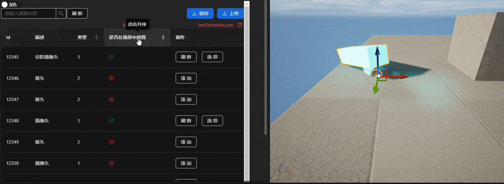

# unreal-editor-tool

---

### 该插件的作用

使在场景中放置大量带有独特的数据的`mesh`更加轻松，添加`mesh`的位置、旋转和缩放信息，并保存为`json`

### 功能

* 导入`json`文件


* 根据`json`信息在场景中生成mesh


* 将新的`actor`的位置、旋转和缩放信息，保存到`json`中


* 视角跳转


* 重置`Actor`信息


* 导出\保存`json`信息

  

  + 排序、搜索和切换主题

  

### 使用方法

* 下载[release](https://github.com/wild-deer/unreal-editor-tool/releases)


* 将插件解压缩，放在`unreal`项目的目录下
* 启动工程，在插件中启用`editor tool`
* 选择模式
* 导入`json`
* 添加`actor`位置信息
* 保存`actor`位置信息
* 保存\导出`json`

### 修改页面样式

* 克隆仓库

```bash
git clone https://github.com/wild-deer/unreal-editor-tool.git
```

* 用`WebStorm`打开

主界面

子界面

入口

* 修改好后打包

```bash
npm run build
```

* 复制打包文件

放在`\Plugins\UE4-EditorScriptingToolsPlugin-main\Content\HTML`目录下


修改完成
